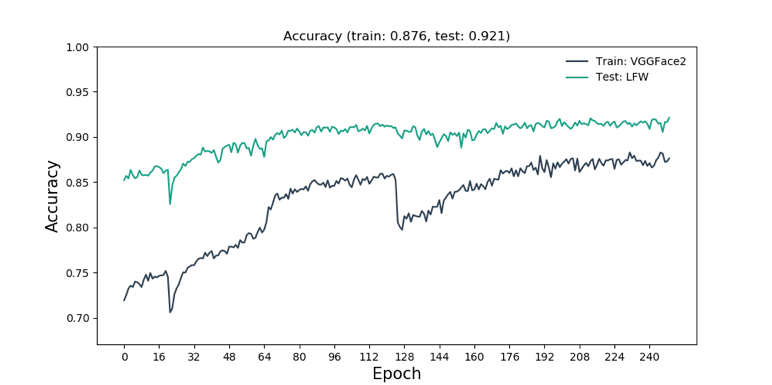
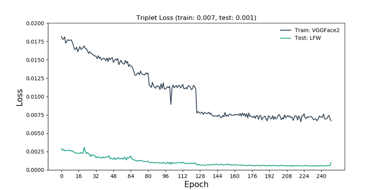

# FaceNet: A Unified Embedding for Face Recognition and Clustering
- This is a **Pytorch** implementation of the paper [**FaceNet: A Unified Embedding for Face Recognition and Clustering**](https://arxiv.org/abs/1503.03832)
- Training of network is done using **triplet loss**.
- This work is modified in some functionality from the original work by [Taebong Moon](https://github.com/tbmoon/facenet) and then retrained for the purpose of completing this work. 

# How to train/validate model
- Download vggface2 (for training) and lfw (for validation) datasets.
  - [**vggface2**](https://www.robots.ox.ac.uk/%7Evgg/data/vgg_face2/)
  - [**lfw**](http://vis-www.cs.umass.edu/lfw/lfw.tgz)

- Align face image files by following David Sandberg's instruction (part of "Face alignment").
  - https://github.com/davidsandberg/facenet/wiki/Classifier-training-of-inception-resnet-v1

- Write list file of face images by running "datasets/write_csv_for_making_dataset.py"
  - `python write_csv_for_making_dataset.py --root-dir=/path/to/dataset/dir --final-file=dataset.csv`
  - `datasets/write_csv_for_making_dataset.py` is multiprocess version of previous `.ipynb`. This way generating csv dataset is much faster.
  
- Train
  - Again, one need to modify paths in accordance with location of image dataset.
  - Also feel free to change some parameters.
  
  
# Results

- Accuracy on VGGFace2 and LFW datasets

- Triplet loss on VGGFace2 and LFW datasets

- ROC curve on LFW datasets for validation

- True counts on each threshold

- Test the model on 30 pair of images with threshold 1.5

