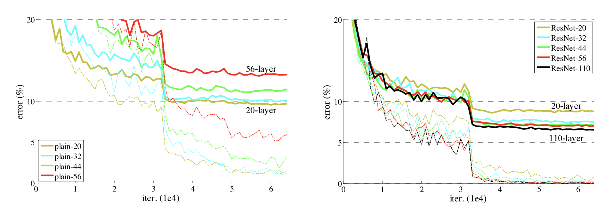
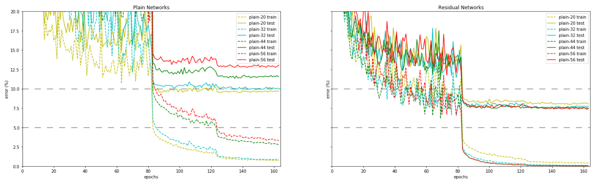

# Deep Residual Learning for Image Recognition: 

- This is an implementation of  [**Deep Residual Learning for Image Recogniton**](https://arxiv.org/abs/1512.03385). 
- This **PyTorch** implementation **produces results within 1% of the authors' reported test error**. 
- The dataset used is [**CIFAR-10**](https://www.cs.toronto.edu/~kriz/cifar.html) as per the **section 4.2** of the paper

# Working and Results

- The main training procedure is described as a jupyter notebook in `main.ipynb` viewable [here](https://nbviewer.jupyter.org/github/a-martyn/resnet/blob/master/main.ipynb).

- The goal is to **classify tiny 32x32 pixel images into one of 10 classes**. 

- This implementation achieves **92.67% test set accuracy** in this setting.

<p align='center'>
<br>
<b>Sample Outputs</b><br>
</p>

## Getting Started

### Prequesites

- Linux or MacOS
- Python 3
- CPU or NVIDIA GPU + CUDA CuDNN

### Installation

- Setup environment and install dependencies with pip:

```
python -m venv venv
source venv/bin/activate
pip install -r requirements.txt
```

- Train the model! Launch jupyter notebooks and run `main.ipynb`:

```
jupyter notebook
```
- in Jupyter open `main.ipynb` and execute top-to-bottom


 ## Results from the original paper



Figure 6. (from original paper) Training on CIFAR-10. Dashed lines denote training error, and bold lines denote testing error. **Left**: plain networks. The error of plain-110 is higher than 60% and not displayed. **Right**: ResNets.

## Results from this implementation



A recreation of Figure 6. showing the results from this implementation for comparison. All annotations are matched. Epochs are used for x-axis where 1 epoch is equivalent to 391 iterations in Figure 6. 110 layer networks are not tested.

## Best test error

| Architecture | #layers | % Test Error (original paper) | % Test Error (this implementation)  |
| --- | --- | --- | --- |
| Plain Net | 20 | 9.5\* | 9.5 |
| Plain Net | 32 | 10\* | 9.92 |
| Plain Net | 44 | 12\* | 11.35 |
| Plain Net | 56 | 13.5\* | 12.76 |
| ResNet | 20 | 8.75 | 8.0 |
| ResNet | 32 | 7.51 | 7.51 |
| ResNet | 44 | 7.17 | 7.38 |
| ResNet | 56 | 6.97 | 7.33 |

\* approximate readings from Figure 6.

### Classification error on the CIFAR-10 test set. 
- The lowest test error achieved across all training epochs is reported. 
- The best test error reproduced for plain networks is approximately equivalent to the original paper and 0.36% higher than cited in the original paper for resnets. 
- For the 20-layer resnet we observe a test error 0.75% below that reported in the original paper.

