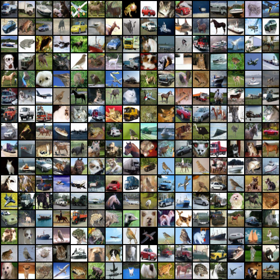

# Denoising Diffusion Probabilistic Models

- This is a **PyTorch** implementation of [**Denoising Diffusion Probabilistic Models**](https://arxiv.org/abs/2006.11239)

## Overview
- Datasets
    - [x] Support CIFAR10
- Feature
    - [x] Multi-GPU training
- Reproducing Experiment
    - [x] CIFAR10

## Requirements
- Python 3.6
- Packages
    Upgrade pip for installing latest tensorboard
    ```
    pip install -U pip setuptools
    pip install -r requirements.txt
    ```
- Download precalculated statistic for dataset:

    [cifar10.train.npz](https://drive.google.com/drive/folders/1UBdzl6GtNMwNQ5U-4ESlIer43tNjiGJC?usp=sharing)

    Create folder `stats` for `cifar10.train.npz`.
    ```
    stats
    └── cifar10.train.npz
    ```

## Train From Scratch
- Take CIFAR10 for example:
    ```
    python main.py --train \
        --flagfile ./config/CIFAR10.txt
    ```
- [Optional] Overwrite arguments
    ```
    python main.py --train \
        --flagfile ./config/CIFAR10.txt \
        --batch_size 64 \
        --logdir ./path/to/logdir
    ```
- [Optional] Select GPU IDs
    ```
    CUDA_VISIBLE_DEVICES=1 python main.py --train \
        --flagfile ./config/CIFAR10.txt
    ```
- [Optional] Multi-GPU training
    ```
    CUDA_VISIBLE_DEVICES=0,1,2,3 python main.py --train \
        --flagfile ./config/CIFAR10.txt \
        --parallel
    ```

## Evaluate
- A `flagfile.txt` is autosaved to your log directory. The default logdir for `config/CIFAR10.txt` is `./logs/DDPM_CIFAR10_EPS`
- Start evaluation
    ```
    python main.py \
        --flagfile ./logs/DDPM_CIFAR10_EPS/flagfile.txt \
        --notrain \
        --eval
    ```
- [Optional] Multi-GPU evaluation
    ```
    CUDA_VISIBLE_DEVICES=0,1,2,3 python main.py
        --flagfile ./logs/DDPM_CIFAR10_EPS/flagfile.txt \
        --notrain \
        --eval \
        --parallel
    ```


## Reproducing Experiment

### CIFAR10
- **FID: 3.249, Inception Score: 9.475(0.174)**



- The checkpoint can be downloaded from here 👉🏻 : [Google Drive Link](https://drive.google.com/file/d/1IhdFcdNZJRosi3XRT7-qNmiPGTuyuEXr/view?usp=sharing).


